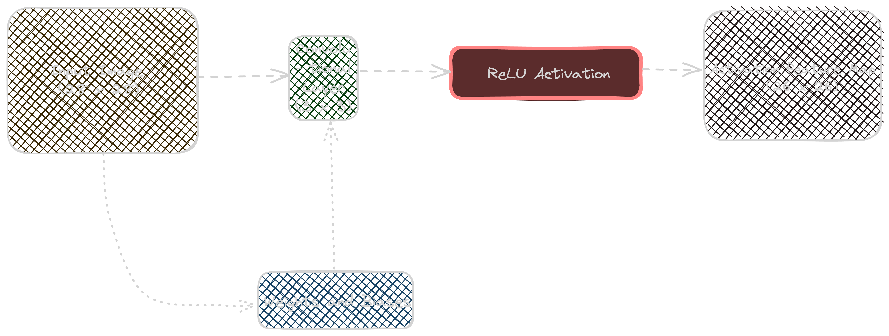

# CNN in C


This project implements a simple Convolutional Neural Network (CNN) in C from scratch.



A convolutional layer with a subsequent Rectified Linear Unit (ReLU) activation. This structure forms the cornerstone of many sophisticated image processing and computer vision systems.

## Structure

- `src/`: Contains the source code files.
- `include/`: Contains header files for the project.
- `data/`: Directory for input data files.
- `tests/`: Contains test files for validating functionality.
- `Makefile`: Build script for compiling the project.
- `README.md`: Documentation for the project.

## Build Instructions

To compile the project, run:

```sh
make
```
After building, run the executable:

```sh
./BasicCNN
```

To run the tests, execute:

```sh
make test
```

## Project Structure

```
cnn_project/
    │
    ├── src/                     # Source files
    │   ├── BasicCNN.c           # Main CNN implementation
    │   └── Utils.c              # Utility functions (if needed)
    │
    ├── include/                 # Header files
    │   ├── BasicCNN.h           # Header for CNN functions
    │   └── Utils.h              # Header for utility functions
    │
    ├── data/                    # Input data files
    │   └── InputData.txt        # Example input data file
    │
    ├── tests/                   # Test files
    │   └── TestBasicCNN.c       # Unit tests for CNN functions
    │
    ├── Makefile                 # Build script
    │
    └── README.md                # Project documentation
```